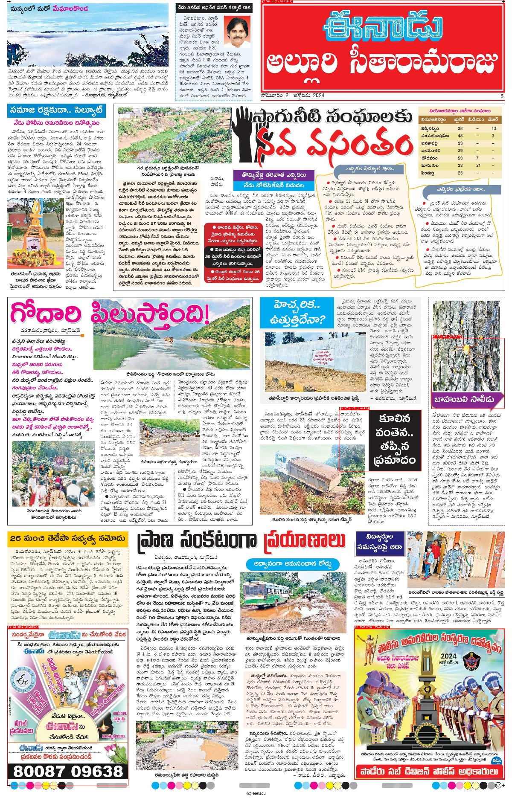

# Newspaper Advertisement Detection (Telugu — Sakshi / Eenadu)

Detect **advertisements** on scanned newspaper pages, **measure each ad's size in
real cm²**, and **draw boxes** around them — then browse everything in a
dashboard. **100% free, 100% local. No cloud, no API keys, no paid services.**
CPU works; a GPU only makes the optional deep-learning steps faster.

**Not comfortable with the command line?** See **[QUICKSTART.md](QUICKSTART.md)** —
just double-click `run_dashboard.command` (macOS) or `run_dashboard.bat`
(Windows) and the dashboard opens in your browser.

### Baseline detector on a real Eenadu page



The built-in classical detector running on a genuine Eenadu page (rendered from
a public Internet Archive edition). It correctly boxes the bottom display ad and
proposes other bordered candidates. On dense news pages it **over-proposes**
(news photos / boxed items look like ads) — this is expected, and exactly why
the dashboard lets you keep/fix/draw boxes and **fine-tune a model** that learns
what a real ad is. That loop is the path to high accuracy on Telugu pages.

---

## Why this approach (the research)

We reviewed the current state of the art before building. Key findings:

* **Ads are best detected as *visual objects*, not via pure text/layout rules.**
  The 2025 *AdVision* study (Machine Learning with Applications) found a trained
  **YOLOv8** detector beats two-stage and transformer detectors for newspaper
  ads — and that **training on one language transfers to another**, because ads
  are visual. This is almost certainly why earlier pure-heuristic attempts
  plateaued.
* **No off-the-shelf model is trained on Telugu ads.** The closest free,
  local starting points are *Newspaper Navigator* (has an "advertisement"
  class) and *DocLayout-YOLO* (newspaper-aware layout). They give partial recall
  zero-shot.
* **The honest path to high accuracy** is: a working baseline today **+** a
  human-correction loop that builds a Telugu ad dataset **+** a local YOLOv8
  fine-tune. No model is 100% accurate zero-shot on Telugu.

So this project gives you **both**: a baseline that runs immediately, and the
tooling to reach high accuracy on *your* pages.

---

## How it works

```
page image ──▶ calibrate px→cm ──▶ detect ads ──▶ size in cm² ──▶ draw boxes + JSON
                                      │
                  heuristic │ doclayout │ yolov8 │ ensemble   (pluggable backends)
```

* **Calibration (`src/calibration.py`)** — converts pixels to centimetres so
  sizes are *real*. Default mode `auto_content` finds the printed-content box on
  each page and maps its width to the publication's print width (**33 cm** for
  Sakshi/Eenadu broadsheets). This is robust to unknown DPI and white scan
  margins. (You can switch to a fixed-DPI mode in `config.yaml`.)
* **Detectors (`src/detectors/`)**
  * `heuristic` — classical CV (OpenCV). Finds rectangles framed by ruled
    borders and verifies all four edges are real lines. **No downloads, fully
    offline, always works.** Good Day-1 baseline for boxed display ads.
  * `doclayout` — DocLayout-YOLO (newspaper-aware). `pip install doclayout-yolo`.
  * `yolov8` — **your fine-tuned** ad model (most accurate). `pip install ultralytics`.
  * `ensemble` — union of heuristic + a model, de-duplicated with NMS.
* **Sizing (`src/sizing.py`)** — `width_cm × height_cm = area_cm²` per ad, drops
  sub-threshold noise, reports total ad area and % page coverage.
* **Dashboard (`app/dashboard.py`)** — browse pages, view boxes + cm², **correct
  the boxes**, and **export a YOLO dataset** for fine-tuning.

---

## Quick start

```bash
pip install -r requirements.txt          # core deps only; models are optional

# 1) Try it on the bundled synthetic page
python scripts/make_sample.py
python scripts/run_batch.py data/images/sample_sakshi.png

# 2) Run on YOUR scraped newspaper folder
python scripts/run_batch.py "/path/to/scraped_images"
#   -> data/output/<name>_ads.jpg  (boxes + cm² labels)
#   -> data/output/<name>.json     (per-ad sizes)
#   -> data/output/summary.json

# 3) Browse + correct in the dashboard
streamlit run app/dashboard.py
```

> **Note on your data:** your `scraped_images/` folder lives on your Mac, not in
> this repo (newspaper scans aren't committed). Just point `run_batch.py` / the
> dashboard `Image folder` at it.

---

## Reaching high accuracy on Telugu ads (the fine-tune loop)

1. Run the baseline over a few hundred pages.
2. In the dashboard, fix the boxes (add missed ads, delete wrong ones, adjust
   edges) and **Save corrections**.
3. Click **Export corrections → YOLO dataset** (or `python -m src.dataset_export`).
4. Fine-tune locally:
   ```bash
   pip install ultralytics
   python -m src.train               # writes models/ads_yolov8.pt
   ```
5. Switch the backend in `config.yaml`:
   ```yaml
   detection:
     backend: yolov8
     yolov8_weights: models/ads_yolov8.pt
   ```
Re-run — accuracy climbs as you label more pages. Everything stays on your
machine at zero cost.

---

## Configuration (`config.yaml`)

| Key | Meaning |
|-----|---------|
| `publications.*.page_width_cm/height_cm` | physical print area per paper (Sakshi/Eenadu = 33×52 cm) |
| `calibration.mode` | `auto_content` (recommended) or `dpi` |
| `detection.backend` | `heuristic` / `doclayout` / `yolov8` / `ensemble` |
| `detection.min_ad_area_cm2` | drop ads smaller than this (noise filter) |
| `heuristic.*` | border-detection tuning |
| `output.*` | box colour / thickness / labels |

The publication is auto-guessed from the file path (`sakshi`, `eenadu`, …),
falling back to `default`.

---

## Project layout

```
config.yaml              tunables (page sizes, backend, thresholds)
src/
  calibration.py         px → cm (auto content-box or DPI)
  detectors/             heuristic + model + ensemble backends
  sizing.py              cm² sizes + filtering
  pipeline.py            image/folder → boxes + JSON + annotated page
  visualize.py           draw boxes + cm² labels
  dataset_export.py      corrections → YOLO dataset
  train.py               local YOLOv8 fine-tune
app/dashboard.py         Streamlit: browse / correct / export
scripts/run_batch.py     CLI batch runner
scripts/make_sample.py   synthetic demo page
tests/test_pipeline.py   smoke tests
```

## Tests

```bash
python tests/test_pipeline.py        # or: pytest -q
```

## License / cost

All dependencies are open-source (OpenCV, NumPy, Pillow, Streamlit; optional
Ultralytics/DocLayout-YOLO). No paid or cloud services are used anywhere.
